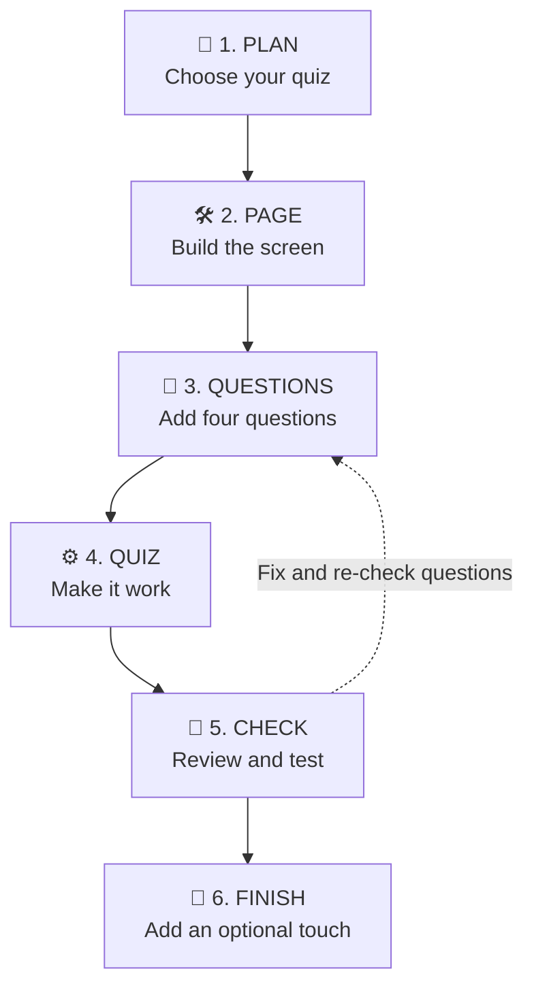

# Build a Catchphrase Quiz with GitHub Copilot

In one hour, you will use GitHub Copilot
to plan and build a working quiz app through the **Copilot Power Loop**:



## You are the Builder. Copilot is your Helper.

Copilot cannot guess exactly what you want. You need to give it clear
instructions, like you would when explaining a task to a teammate.


Meet your **Copilot agents team**! Each agent has one job:

- 🤖 **plan-quiz** is the team planner. It helps you choose what to build.
- 🤖 **build-page** creates the quiz screen.
- 🤖 **add-questions** adds your questions.
- 🤖 **build-quiz** makes the buttons and quiz behavior work.
- 🤖 **check-quiz** checks the finished quiz.
- 🤖 **add-finish** adds one optional finishing touch.

You will move through the agents yourself. For each step, open the
**agent picker** near the chat input, choose the agent named in the
instructions, type the prompt shown, and press **Submit**.

## 🧠 1. PLAN your quiz — 8 minutes

Open and read
[`plan-quiz.agent.md`](.github/agents/plan-quiz.agent.md).

Take note of:

- What Copilot must do
- Which files it will read
- What it must not do
- How you will test the result

Open the [`question bank`](QUESTION-BANK.md). Choose four letters, such as
**A, C, F and H**.

### Start here

1. Open **Copilot Chat** by selecting the Copilot icon.
2. Open the agent picker near the chat input.
3. Choose this agent:

   > 🤖 **`plan-quiz`**

4. Type the message below, then press **Submit**:

   ```text
   Help me plan my quiz.
   ```

5. Answer Copilot's questions:
   - Your quiz name
   - Two main colours
6. Read the plan. Ask Copilot to change anything you do not like.
7. Check that the plan uses your quiz name and colours.

## 🛠️ 2. BUILD the page — 10 minutes

Open and read
[`build-page.agent.md`](.github/agents/build-page.agent.md).

Take note of:

- What page elements Copilot must build
- Which files it will change
- What it must not change
- How you will test the page

### Start here

1. Open the agent picker and choose:

   > 🤖 **`build-page`**

2. Type the message below, then press **Submit**:

   ```text
   Build the quiz page for my plan.
   ```

3. Look at the files Copilot changed. Find your quiz name in `index.html` and
   your colours in `styles.css`.
4. Refresh the browser. You should see your quiz design. The buttons will not
   work yet because you have not built the quiz behaviour.

## 🛠️ 3. BUILD the questions — 8 minutes

Open and read
[`add-questions.agent.md`](.github/agents/add-questions.agent.md).

Take note of:

- How many questions to add
- What each question must include
- Which file Copilot will change
- How you will check the question data

### Start here

1. Open the agent picker and choose:

   > 🤖 **`add-questions`**

2. Type four question letters from `QUESTION-BANK.md`, for example:

   ```text
   Add these four questions: A, C, F and H.
   ```

   Replace the letters with your choices. This first setup adds four
   questions.

3. Press **Submit**.
4. When Copilot finishes, open `questions.js`. Make sure it contains your four
   selected questions and four answers for each question.
5. Check that Copilot reports:

   ```text
   Checked 4 quiz questions successfully.
   ```

The browser will not change yet. The questions are ready, but the quiz
behaviour has not been built.

## 🛠️ 4. BUILD the quiz behaviour — 14 minutes

Open and read
[`build-quiz.agent.md`](.github/agents/build-quiz.agent.md).

Take note of:

- What the quiz must do
- Which file Copilot will change
- What it must not change
- How you will test the quiz

### Start here

1. Open the agent picker and choose:

   > 🤖 **`build-quiz`**

2. Type the message below, then press **Submit**:

   ```text
   Add the JavaScript behaviour now that the page and questions exist.
   ```

3. Wait for Copilot to finish building the quiz.

## 👀 5. CHECK and 🧪 TEST the finished quiz — 10 minutes

Open and read
[`check-quiz.agent.md`](.github/agents/check-quiz.agent.md).

Take note of:

- What Copilot will check
- What Copilot must not change
- How you will test the finished quiz

### Start here

1. Open the agent picker and choose:

   > 🤖 **`check-quiz`**

   Then type:

   ```text
   Check my quiz against the requirements.
   ```

2. Read the list marked **PASS** or **FIX**.
3. If something does not work, open the agent picker and choose:

   > 🤖 **`fix-one-problem`**

4. Type the message below, and press **Submit**:

   ```text
   Fix this problem. I expected [what should happen], but [what happened].
   ```

5. Open the agent picker and choose:

   > 🤖 **`check-quiz`**

   Then type the message below, and press **Submit**:

   ```text
   Re-check my quiz against the requirements.
   ```

## 🎉 6. Finish and show — 5 minutes

The quiz is complete and now ready to use.

Test the quiz:
   1. Start the quiz.
   2. Choose one wrong answer.
   3. Choose one correct answer on the next question.
   4. Finish all four questions.
   5. Check the final score.
   6. Restart and check that the score returns to zero.


### Optional: Add another question

If you want to add another question after checking the quiz:

1. Open the agent picker and choose:

   > 🤖 **`add-questions`**

2. Type:

   ```text
   Add question B from QUESTION-BANK.md. Keep all existing questions.
   ```

   Replace `B` with one new question ID.
3. Press **Submit**. Keep the existing questions; this adds one more.


### Optional finishing touch

1. If your quiz works and you have time, open the agent picker and choose:

   > 🤖 **`add-finish`**

2. Type:

   ```text
   Add a [timer, streak, confetti, or hint] to my quiz.
   ```

3. Press **Submit**.

Show your quiz to another student. Explain one piece of code Copilot helped you
build.

## You are finished when

- You approved a plan before coding.
- You built the page.
- You added four questions.
- Start, answers, feedback, score, next, results and restart work.
- You tested both a correct and an incorrect answer.
- You can explain one code change.

## If the webpage disappears

Open the terminal at the bottom of Codespaces. Type this command and press
Enter:

```bash
npm start
```

Do not share passwords, personal information or secret keys with Copilot.
