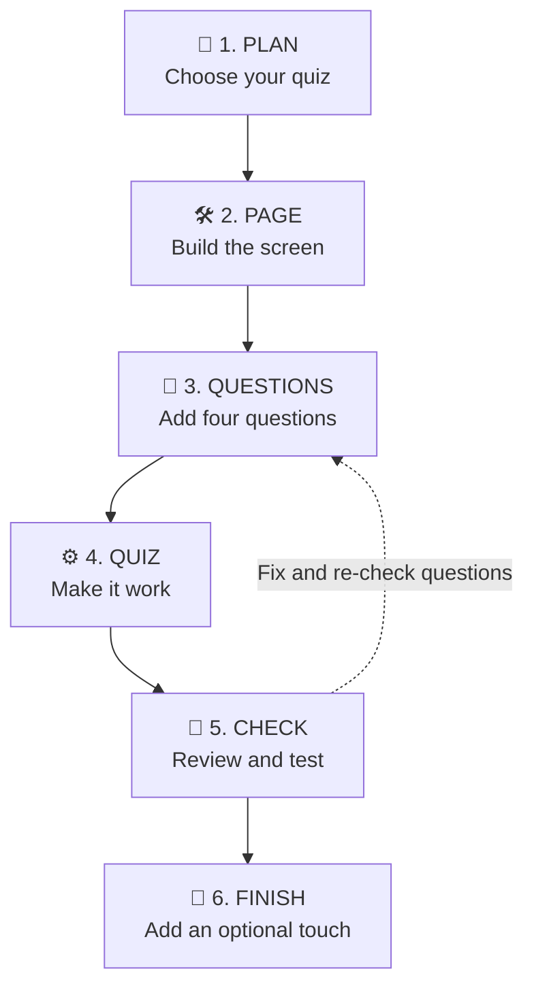

# Build a Catchphrase Quiz with GitHub Copilot

In one hour, you will use GitHub Copilot
to plan and build a working quiz app through the **Copilot Power Loop**:



## You are the Builder. Copilot is your Helper.

Copilot cannot guess exactly what you want. You need to give it clear
instructions, like you would when explaining a task to a teammate.

In this exercise, the instructions are pre-made for you as **custom agents**.
Each of them tells Copilot:

- What to build
- Which files to look at
- What rules to follow
- How to check its work

Each agent finishes with a **handoff button** that takes you straight to the
next agent in the loop. When you select the first agent, type a request before
pressing **Submit**. After that, use the handoff buttons and follow any prompt
shown in the chat box.

## 🧠 1. PLAN your quiz — 8 minutes

Open and read
[`plan-quiz.agent.md`](.github/agents/plan-quiz.agent.md).

Take note of:

- What Copilot must do
- Which files it will read
- What it must not do
- How you will test the result

Open the [`question bank`](QUESTION-BANK.md). Choose four letters, such as
**A, C, F and H**.

### Start here

1. Open **Copilot Chat** by selecting the Copilot icon.
2. Open the agent picker near the chat input.
3. Choose this agent:

   > 🤖 **`plan-quiz`**

4. Type the message below, then press **Submit**:

```text
Help me plan my quiz.
```

5. Answer Copilot's questions:
   - Your quiz name
   - Two main colours
   - Four question letters from `QUESTION-BANK.md`
6. Read the plan. Ask Copilot to change anything you do not like.
7. Check that the plan uses your quiz name, colours and four question letters.
8. When you are happy with it, tell Copilot:

```text
I approve this plan.
```

9. Select the **Build the page** handoff button that appears under Copilot's
   reply. If a prompt appears, press **Submit**.

## 🛠️ 2. BUILD the page — 10 minutes

Open and read
[`build-page.agent.md`](.github/agents/build-page.agent.md).

### Start this step

1. Check that 🤖 **`build-page`** is selected. If it is not, select it from the agent picker.

2. Look at the files Copilot changed. Find your quiz name in `index.html` and
   your colours in `styles.css`.
3. Refresh the browser. You should see your quiz design. The buttons will not
   work yet because you have not built the quiz behaviour.
4. Select the **Add the questions** handoff button.

## 🛠️ 3. BUILD the questions — 8 minutes

Open and read
[`add-questions.agent.md`](.github/agents/add-questions.agent.md).

### Start this step

1. Check that 🤖 **`add-questions`** is selected. If it is not, select it from the agent picker.

2. If the handoff did not provide a message, type:

   ```text
   Add these four questions: A, C, F and H.
   ```

   Replace the letters with your choices. This first setup adds four
   questions.

3. Press **Submit**.
4. When Copilot finishes, open `questions.js`. Make sure it contains your four
   selected questions and four answers for each question.
5. Check that Copilot reports:

   ```text
   Checked 4 quiz questions successfully.
   ```

The browser will not change yet. The questions are ready, but the quiz
behaviour has not been built.

6. Select the **Make the quiz work** handoff button.

## 🛠️ 4. BUILD the quiz behaviour — 14 minutes

Open and read
[`build-quiz.agent.md`](.github/agents/build-quiz.agent.md).

### Start this step

1. Check that 🤖 **`build-quiz`** is selected. If it is not, select it from the agent picker.

2. Wait for Copilot to finish building the quiz.
3. Read Copilot's explanation of the main functions in `app.js`. Ask questions
   if anything is unclear.
4. Test the quiz:
   1. Start the quiz.
   2. Choose one wrong answer.
   3. Choose one correct answer on the next question.
   4. Finish all four questions.
   5. Check the final score.
   6. Restart and check that the score returns to zero.
5. Select the **Check my quiz** handoff button.
6. If the message box is empty, type:

   ```text
   Check my finished quiz against the requirements.
   ```

7. Press **Submit**.

## 👀 5. CHECK and 🧪 TEST the finished quiz — 10 minutes

### Start this step

1. Check that 🤖 **`check-quiz`** is selected. If it is not, select it from the agent picker.

2. Read the list marked **PASS** or **FIX**.
3. Test each item yourself. Do not trust a PASS until you have seen it work.
4. If something does not work, select the **Fix one problem** handoff button.
5. If the message box is empty, type:

   ```text
   Fix this problem. I expected [what should happen], but [what happened].
   ```

6. Tell Copilot:

- What you expected
- What actually happened

7. Test the fix before moving on.
8. When it works, choose **check-quiz** from the agent picker and type:

```text
Re-check my quiz against the requirements.
```

9. Press **Submit**.

If you want to add another question after checking the quiz:

1. Select **Add one question**.
2. If the message box is empty, type:

   ```text
   Add question B from QUESTION-BANK.md. Keep all existing questions.
   ```

   Replace `B` with one new question ID.
3. Press **Submit**. Keep the existing questions; this adds one more.

## 🎉 6. Finish and show — 5 minutes

### Optional finishing touch

1. If your quiz works and you have time, select the **Add a finishing touch**
   handoff button from check-quiz.
2. Check that 🤖 **`add-finish`** is selected. If it is not, select it from
   the agent picker.
3. If the message box is empty, type:

   ```text
   Add a [timer, streak, confetti, or hint] to my quiz.
   ```

4. Press **Submit**.

Show your quiz to another student. Explain one piece of code Copilot helped you
build.

## You are finished when

- You approved a plan before coding.
- You built the page.
- You added four questions.
- Start, answers, feedback, score, next, results and restart work.
- You tested both a correct and an incorrect answer.
- You can explain one code change.

## If the webpage disappears

Open the terminal at the bottom of Codespaces. Type this command and press
Enter:

```bash
npm start
```

Do not share passwords, personal information or secret keys with Copilot.
